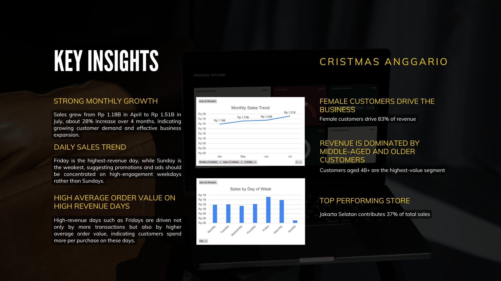

# Retail Sales Analysis

## Business Problem
A retail business with 7 stores across Greater Jakarta needs to understand 
what drives sales and which customer segments, locations, and time periods 
generate the most value.

This analysis answers four core questions:
1. Which stores are driving the most revenue?
2. Who are the highest-value customers by age and gender?
3. When do customers spend the most — by month and day of week?
4. Where should the business focus its marketing investment?

## Key Findings
- Total revenue of **Rp 5.3B** across 9,636 transactions (April–July)
- **Jakarta Selatan** is the top-performing store, contributing **37% of total revenue** (Rp 1.99B) across 7 locations
- **Female customers aged 48+** generate over 70% of total revenue (≈ Rp 3.9B), 
  making them the core customer segment
- **Friday** is the highest-revenue day — driven by both higher transaction 
  volume and higher average order value
- Monthly sales grew from **Rp 1.18B in April to Rp 1.51B in July** — 
  a 28% increase over 4 months

## Business Recommendations
1. Prioritize marketing budget and inventory in Jakarta Selatan — 
   highest revenue store with proven demand
2. Target female customers aged 48+ with tailored promotions — 
   they drive the majority of business value
3. Concentrate campaigns on Fridays and high-engagement weekdays — 
   reduce spend on Sundays which show the weakest performance
4. Develop targeted campaigns for male customers and under-30 age group — 
   currently underperforming but represent untapped growth potential

## Tools
- Excel — data cleaning, feature engineering, pivot tables, charts
- PowerPoint — analysis presentation

## Dataset
- 9,636 transactions across 7 stores
- Time period: April–July
- 959 unique customers
- Covers transaction amount, customer demographics, store location, 
  and purchase date

## Presentation
Full analysis presentation: [View PDF](retail-sales-analysis.pdf)

## Preview

*Full presentation available on request.*
